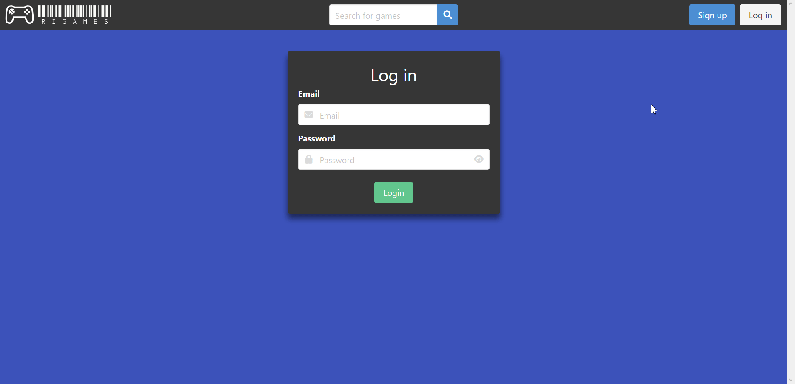
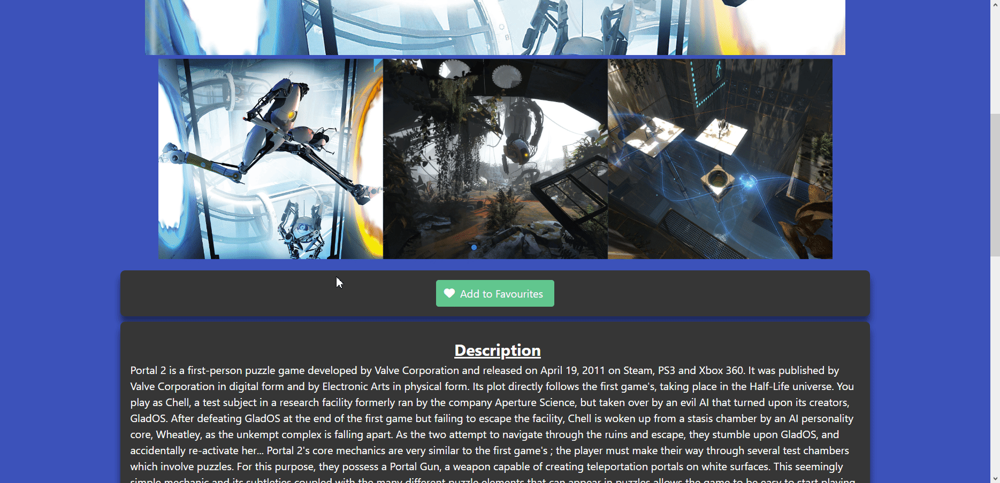

# Videogame cataloguing website using MERN stack
## Creators: 
- [Gowtham Rajendra](https://github.com/GowthamRajendra)
- [Ivan Wang](https://github.com/Ivan-WangJianBin)
- [Ravi Pogaku](https://github.com/Ravi-Pogaku)

## Table of Contents
- [How to Run](#how-to-run)
- [Login/Signup Page](#loginsignup-page)
- [Home Page](#home-page)
- [Search Page](#search-page)
- [Game Page](#game-page)
- [Add to Favourites](#add-to-favourites)
- [Profile Page](#profile-page)
- [Citations](#citations)

## How to Run
Requirement: You need to have the npm package manager installed and NodeJS for the server. Preferably nodemon should be installed to make running the NodeJS server easier.

1. On a terminal, do npm install inside both server and client folders to get all the neccessary packages to run the project.<br>
2. Make a MongoDB Atlas account, create a cluster and database.<br>
3. Sign up for RAWG API key.<br>
4. Create the .env file in the server folder. Put MongoDB Atlas database URL, the API key inside and a secret code for signing the JSON Web Token in the .env file.<br>
   - The .env file will look something like this:
      ```
      SECRET_KEY={your secret code}
      API_KEY={your API key}
      MONGODB_URL={mongodb+srv://{username}:{password}@{your cluster name}.7jexus8.mongodb.net/{your database name}?retryWrites=true&w=majority}
      ```
5. Open two terminals to run the server and client concurrently.<br>
6. On the first terminal, enter the server folder and run `nodemon` to start the server.<br>
7. On the second terminal, enter the client folder and run `npm run dev` to run the client side. 
Alternatively, on the client side, run `npm run build` followed by `npm run preview` to run the production version.<br>

## Login/Signup Page
<br>
[Back to Top](#videogame-cataloguing-website-created-with-mern-stack)

## Home Page
<br>
[Back to Top](#videogame-cataloguing-website-created-with-mern-stack)

## Search Page
<br>
[Back to Top](#videogame-cataloguing-website-created-with-mern-stack)

## Game Page
<br>
[Back to Top](#videogame-cataloguing-website-created-with-mern-stack)

## Add to Favourites
<br>
[Back to Top](#videogame-cataloguing-website-created-with-mern-stack)

## Profile Page
<br>
[Back to Top](#videogame-cataloguing-website-created-with-mern-stack)

# Citations
- https://freefrontend.com 
- https://bulma.io/documentation/
- https://developer.mozilla.org/en-US/
- https://stackoverflow.com
- https://www.youtube.com/@NetNinja
- https://d3-graph-gallery.com/graph/pie_basic.html
- https://d3-graph-gallery.com/graph/barplot_horizontal.html
- https://swiperjs.com/demos
- https://loading.io/css/
- https://www.npmjs.com <br> <br>
[Back to Top](#videogame-cataloguing-website-created-with-mern-stack)
